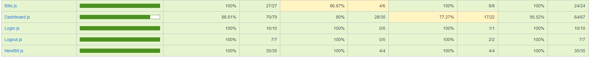
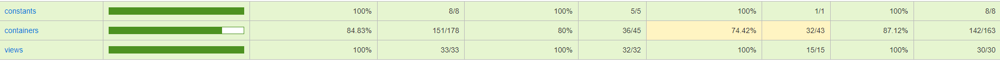

## L'architecture du projet :
Ce projet, dit frontend, est connecté à un service API backend que vous devez aussi lancer en local.

Le projet backend se trouve ici: https://github.com/OpenClassrooms-Student-Center/Billed-app-FR-back

## Organiser son espace de travail :
Pour une bonne organization, vous pouvez créer un dossier bill-app dans lequel vous allez cloner le projet backend et par la suite, le projet frontend:

Clonez le projet backend dans le dossier bill-app :
```
$ git clone https://github.com/OpenClassrooms-Student-Center/Billed-app-FR-Back.git
```

```
bill-app/
   - Billed-app-FR-Back
```

Clonez le projet frontend dans le dossier bill-app :
```
$ git clone https://github.com/OpenClassrooms-Student-Center/Billed-app-FR-Front.git
```

```
bill-app/
   - Billed-app-FR-Back
   - Billed-app-FR-Front
```

## Comment lancer l'application en local ?

### étape 1 - Lancer le backend :

Suivez les indications dans le README du projet backend.

### étape 2 - Lancer le frontend :

Allez au repo cloné :
```
$ cd Billed-app-FR-Front
```

Installez les packages npm (décrits dans `package.json`) :
```
$ npm install
```

Installez live-server pour lancer un serveur local :
```
$ npm install -g live-server
```

Lancez l'application :
```
$ live-server
```

Puis allez à l'adresse : `http://127.0.0.1:8080/`


## Comment lancer tous les tests en local avec Jest ?

```
$ npm run test
```

## Comment lancer un seul test ?

Installez jest-cli :

```
$npm i -g jest-cli
$jest src/__tests__/your_test_file.js
```

## Comment voir la couverture de test ?

`http://127.0.0.1:8080/coverage/lcov-report/`

## Comptes et utilisateurs :

Vous pouvez vous connecter en utilisant les comptes:

### administrateur : 
```
utilisateur : admin@test.tld 
mot de passe : admin
```
### employé :
```
utilisateur : employee@test.tld
mot de passe : employee
```
# Bill-app ( coté front-end)

Le but de ce projet était de résoudre des bugs, d'implémenter des tests et faire une fiche E2E

----------------------------------------------
### Bug-report Bills

```
const rows = (data) => {
  const datesSorted = data.sort((a, b) => {
    return (new Date(a.date) < new Date( b.date) ? 1 : -1)})
  return (datesSorted && datesSorted.length) ? datesSorted.map(bill => row(bill)).join("") : ""
}
```
Lien : [src/view/Bills.js](https://github.com/MathieuSchaff/bill-app-front/blob/main/src/views/BillsUI.js)
----------------------------------------------
### Bug report - Login
Code changé :  
`
handleSubmitAdmin = e => {
    e.preventDefault()
    const user = {
      type: "Admin",
      email: e.target.querySelector(`input[data-testid="admin-email-input"]`).value,
      password: e.target.querySelector(`input[data-testid="admin-password-input"]`).value,
      status: "connected"
    }
`  

  Anciennement avec :  
`
email: e.target.querySelector(input[data-testid="employee-email-input"]).value,
password: e.target.querySelector(input[data-testid="employee-password-input"]).value,
`

Lien : [src/container/Login.js](https://github.com/MathieuSchaff/bill-app-front/blob/main/src/containers/Login.js)

----------------------------------------------
### Bug hunt Bills*
Empêcher la saisie d'une extension différente de jpg, jpeg ou png:

`if(file.name.match(/.(jpg|jpeg|png)$/i))`

Lien : [src/container/Dashboard.js](https://github.com/MathieuSchaff/bill-app-front/blob/main/src/containers/NewBill.js)

----------------------------------------------  
### Bug hunt Dashboard  
`bills.forEach(bill => {$(`#status-bills-container${index} #open-bill${bill.id}`).click((e) => this.handleEditTicket(e, bill, bills))})`

Lien : [src/container/Dashboard.js](https://github.com/MathieuSchaff/bill-app-front/blob/main/src/containers/Dashboard.js)
----------------------------------------------
## Tests unitaires
----------------------------------------------
### view/Bills

[Lien vers les tests de Bills](https://github.com/MathieuSchaff/bill-app-front/blob/main/src/containers/Bills.js)



----------------------------
### container/Bills

[Lien vers les tests de Bills](https://github.com/MathieuSchaff/bill-app-front/blob/main/src/containers/Bills.js)


----------------------------
### container/ NewBill

[Lien vers les tests de NewBill](https://github.com/MathieuSchaff/bill-app-front/blob/main/src/containers/NewBill.js)


----------------------------
###  Taux de couverture jest


----------------------------

###  Plan tests END to END

[Lien vers le plan de test END to END](https://github.com/MathieuSchaff/bill-app-front/blob/main/src/containers/E2E-Employee.pdf)
----------------------------